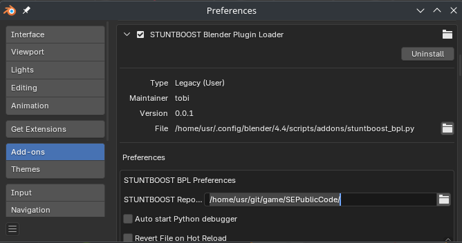

# STUNTBOOST Tools & Friends

This contains tools related to the game STUNBOOST which is currently in development.

## Blender Addons

- Install this addon the legacy way: `blender_addons/loader_addon/stuntboost_bpl.py`
- 
- Configure the addon to point to this repository.
- 
- Restart Blender
- Enjoy

### What plugins are there?
Have a look at the folder `blender_addons/bpl_auto_load/`

- [blender_addons/bpl_auto_load/standalone](blender_addons/bpl_auto_load/standalone) contains addons that function on their own and provide small features.
- [blender_addons/bpl_auto_load/level_editor](.) Maybe one day? 😳

### Meta loader addon?
To allow hot reloading the addons directly out of the git repository, they are loaded via a meta loader addon.
Maybe one day we'll get around to using the new extension format, and even host the addons via a custom extensions repository.

Have a look at [the readme for it here.](blender_addons/loader_addon/README.md)

### Debugging
Error handling is mostly non existent, so check the system console for any errors.

### Disclaimer
This is in-house tooling only tested by us so far. Have fun lol

### More stuff to come as the game progresses!
