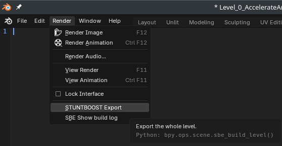
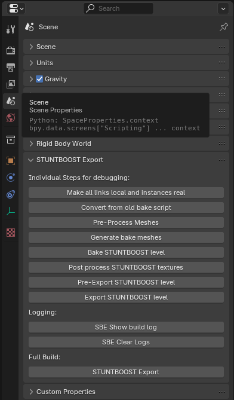

# SBE STUNTBOOST Exporter

# Setup
- Install the custom blender build
  - Windows via precompiled
  - Linux https://projects.blender.org/Tobiasked/blender/src/branch/bake_experiments_4_3
- Install blender plugin loader (bpl) via blender_addons/loader_addon/README.md
- Add Props and Room folder to blender asset library.
  - !!! Make sure to set both libraries to link !!!


# Usage

## Running the export




## CLI bake
Go into ./cli

```
blender -b -P "./sbe_cli.py" -- --help
```

All commands after `--` will be forwarded to the cli script, everything in front will be passed to blender cli interface!

## Functionality

### Current Object Naming Syntax
The objects must be named in the following way to ensure, the game knows what to do with them:\
\{hide\} \{name\} \{type\} \{= \{SomeClass(val1, val2)\} \{.SomePropertyOrMethod(val1)\} \} \{.001\}

Every parameter \{\} is optional. If \{SomeClass(val1, val2)\} is imssing, it will be replaced by 'Entity()'.
- hide ( /, // ):
  - /: hide in blender before exporting
  - //: hide in blender before baking (also won't export)
- name: can be used in c# for finding certain objects. also nice to name your things. naming convention: some_random_name
- type = \{visibility\} \{bake_shadows\} \{collision\}
  - visibility ( _ ):
    - _: invisible during ingame and during bake
    - default: visible
  - bake_shadows ( *, ° )
    - *: visible during bake, but won't be baked to
    - °: invisible during bake
    - default: visible during bake and will be baked to
  - collision ( <, # ):
    - <: solid
    - #: transmissive (used for triggers)
    - default: no ingame collision interaction
  - common name examples:
    - default_visual -> is baked to
    - pre_baked_room* -> isn't baked to
    - something_that_moves° -> isn't baked to and does not cast shadows when baking
    - invisible_collision_<
    - invisible_trigger_#
- .001: this numbered part will be ignored. Use it for duplicates.
- SomeClass and SomePropertyOrMethod: is written similar to C#, but without spaces and without the 'new' keyword. Multiple property setters and/or methods can be chained together. Example:\
some_name#=SomeClass().Move(Vector3(1,0,0)).Disable().Health(100)\

Add // in front of a name, to skip baking and to skip exporting it to the game (commenting it out).
For examples, look through the Level blend files.

### Current Collection Naming Syntax
- bake_group: puts all contained objects onto a new bakemap. When baking, only the bake groups in the current scene with any selected object will be exported.
  - you can provide optional parameters: bake_group=scale_gi|scale_diffuse for scaling the gi bakemap or scaling the diffuse bakemap. If only the scale_gi parameter is given, scale_diffuse will be the same as scale_gi.
- bake_size=X: scales the uvs of the contained objects by a factor of X, before baking.
- //some_collection_name: won't be regarded when baking and exporting.
- rename=rename_from|rename_to: for each object in the collection do the following: inside the name, replace 'rename_from' with 'rename_to'. if 'rename_from' is empty, rename_to will simply be appended to the name.
- append_prop=X: X is some code, that should get added to the code part of the node. For example: 'append_prop=Disable()' will make sure, that the 'Disable()' part is appended to all nodes inside this collection.
- swap_collision_materials=col_material: swap every collision material (C_*) with the specified col_material. for example 'C_Kill'. 
- prevent_join: prevents children from getting joined for export.
- outline_max_thickness=X: sets the max outline thickness for all objects inside this collection. default is 1. 0 means it won't have an outline.
- outline_shift, outline_shift_relative or outline_shrink:
  They are used to modify the outline shift attribute of the vertices. Each function can be used with one of the following syntax to read in a vector (X,Y,Z) that will later manipulate the outline shift attribute:
  - outline_shift=X|Y|Z: simply uses the given parameters.
  - outline_shift=0: X=Y=Z=0
  - outline_shift: this sets X,Y and Z to the local up vector of an empty named 'outline_shift' (or 'outline_shrink' if outline_shrink is used). Please use an Empty Single Arrow for that. The empty only has to start with the name 'outline_shift' and can continue with any other characters. It's also allowed to comment that name out so it won't get exported to the game ('/outline_shift' and '//outline_shift'). Only empties inside the collection will be regarded (first order of children).
  
  outline_shift sets the outline attribute of all vertices to X,Y,Z (transformed to color space (X*0.1 + 0.5)).
  
  outline_shift_relative adds X,Y,Z to the outline attribute of all vertices.
  
  outline_shrink adds a gradient from 0,0,0 to -X,-Y,-Z onto all vertices, where 0,0,0 is applied to the vertices on the bottom and -X,-Y,-Z to the vertices on the top (bottom and top in local space of the given X,Y,Z. Example: top and bottom are different on the wall than on the floor.)
- delete_collisions: deletes all collision objects inside this collection when baking (after '...<' objects have been split into '..._<' and '...')

### Current Vertex Group Naming Syntax
- bake_size=0.2: scales the uvs by a factor of X, before baking
  - Can be disable on the object properties with "Skip UV Mesh Scale"

### Current Modifier Naming Syntax
- //some_modifier_name: will be ignored when baking and exporting
- /some_modifier_name: will be removed after baking
  this is the same as no_export=some_modifier_name  


# Development
- The script is run in smaller "operator" steps to allow for easier debugging.
- These steps are in the `export_operators` folder.
- The order the steps are executed is defined as a sequence in `sbe_sequences.py`
- "operators" defined in the `operators` folder are regular blender operators exposing the bake functionality to the user.


# How to add a new export operator
- Create a py file like `sbe_example.py` in the `export_operators` folder
- Create property in `sbe_operator_ids.py`
- reference it in `sbe_sequences.py` in the `FULL_BAKE_SEQUENCE` at the correct position.
- Operators don't return values and don't receive parameters in this pipeline.
  - They gather the needed data prepared be previous steps
  - The relevant data blocks can be tagged with custom properties
  - These are all in `sbe_custom_properties.py` and imported EXPLICITLY and INDIVIDUALLY by the scripts which read or write to these.

```py
class SBE_Example(bpy.types.Operator):
    bl_idname = SBE_OP_EXAMPLE # Add a property in sbe_operator_ids.py and reference it here
    bl_label = "Example Operator"

    def execute(self, context: bpy.types.Context):
        with SBE_Operator_Start(self, context) as can_start:
            if not can_start:
                return {"FINISHED"}
            # Do something

        return {"FINISHED"}

    @staticmethod
    def bpl_load() -> None:
        bpy.utils.register_class(SBE_Example)

    @staticmethod
    def bpl_unload() -> None:
        bpy.utils.unregister_class(SBE_Example)
```

```py
FULL_BAKE_SEQUENCE = [
    SBE_OP_MAKE_REAL,
    SBE_OP_COMPATIBILITY,
    SBE_OP_EXAMPLE, # <--- added here
    SBE_OP_PREPARE_MESHES,
    SBE_OP_MERGE_MESHES,
    SBE_OP_BAKE,
    SBE_OP_POST_PROCESS,
    SBE_OP_PRE_EXPORT,
    SBE_OP_EXPORT,
]
```

# How to debug
BPL can start `debugpy` on `localhost:5678` through `stand_alone/python_debugger.py`, but it's disabled by default.

Install `debugpy` into Blender's Python once, using Blender's Python Console:

```py
import subprocess, sys
subprocess.check_call([sys.executable, "-m", "pip", "install", "debugpy"])
```

Remove `python_debugger.py` from the Addon Preference, save preferences, and restart Blender.
